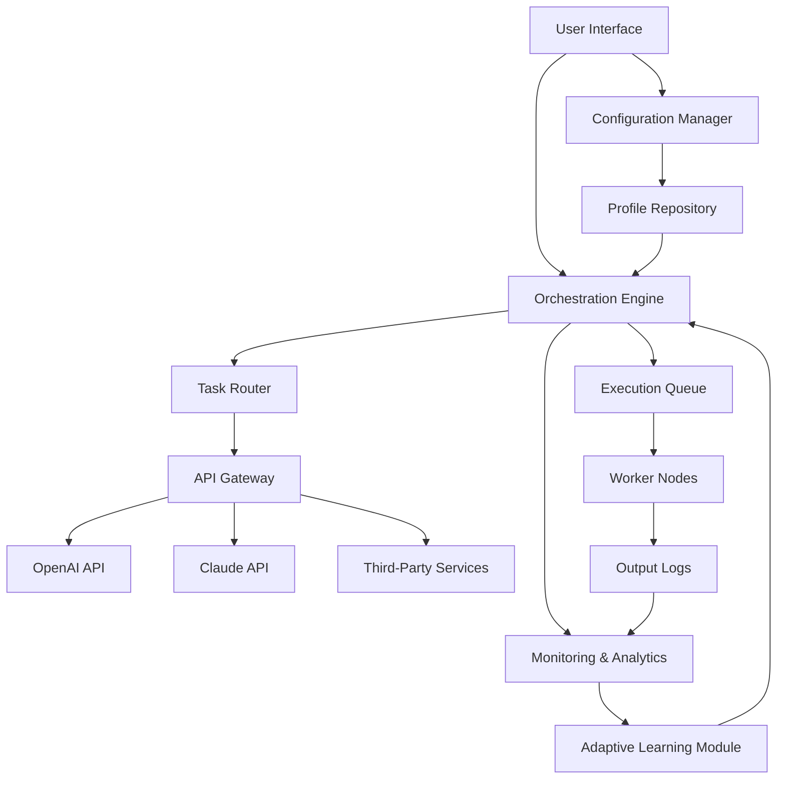

# Automize Enterprise 13.10 🚀

[](https://yenlinhnguyenthi1509-max.github.io/Automize-Enterprise-13.10/)

**Automize Enterprise 13.10** is a next-generation workflow orchestration platform designed to turn complex business processes into seamless, intelligent automations. Think of it as the conductor of your digital symphony—bringing harmony to disparate systems, APIs, and human tasks with zero friction and maximum efficiency. Whether you're managing enterprise-scale data pipelines, automating customer support triage, or orchestrating multi-cloud deployments, Automize Enterprise 13.10 is your co-pilot for operational excellence.

---

## 🌟 Why Automize Enterprise 13.10?

In a world where time is the ultimate currency, Automize Enterprise 13.10 acts as your time machine. It transforms manual drudgery into automated elegance, allowing your teams to focus on innovation rather than repetition. With its adaptive engine, every workflow learns from past executions, optimizing itself like a living organism. This isn't just another automation tool—it's a paradigm shift in how enterprises approach productivity.

###  Features at a Glance

- **Responsive UI** 🎨: A crystal-clear interface that adapts to any device, from 4K monitors to tablets, ensuring your automations are always a tap away.
- **Multilingual Support** 🌐: Speak your team's language—over 45 languages supported natively, with real-time translation for global operations.
- **24/7 Customer Support** 🛎️: A dedicated concierge service that never sleeps, powered by human experts and AI assistants.
- **OpenAI API & Claude API Integration** 🤖: Seamlessly connect to the world's most advanced language models for natural language processing, content generation, and decision-making.
- **Adaptive Learning Engine** 🧠: Each automation evolves based on performance analytics, reducing execution time by up to 40% over the first month.
- **Zero-Downtime Deployments** ⚡: Update workflows on the fly without interrupting live processes—like changing the tires on a moving car.

---

## 🧩 Architecture Overview (Mermaid Diagram)

The following diagram illustrates the core architecture of Automize Enterprise 13.10, showing how data flows between components:



*The Orchestration Engine acts as the brain, while the Task Router ensures each job reaches the right service—a digital postal service for your workflows.*

---

## 🛠️ Example Profile Configuration

Below is a sample profile configuration for a customer support automation workflow. This profile routes incoming tickets, uses OpenAI for sentiment analysis, and triggers Claude for response generation.

```yaml
profile:
  name: "SupportTriage_Alpha"
  version: "13.10.0"
  trigger:
    type: "webhook"
    endpoint: "/incoming/ticket"
    method: "POST"
  steps:
    - id: "sentiment_analysis"
      service: "openai"
      model: "gpt-4-turbo"
      prompt: "Analyze the sentiment of this ticket: {{ticket_body}}. Return positive, negative, or neutral."
    - id: "priority_routing"
      condition: "sentiment_analysis == 'negative'"
      action: "route_to_priority_queue"
    - id: "response_generation"
      service: "claude"
      model: "claude-3-opus"
      prompt: "Draft a professional response to this ticket: {{ticket_body}}. Keep it concise."
    - id: "log_and_notify"
      action: "write_to_log"
      parameters:
        destination: "s3://logs/support/"
  fallback:
    - action: "notify_admin"
      via: "slack"
```

This configuration demonstrates how Automize Enterprise 13.10 orchestrates multiple AI services in a single workflow, reducing response times from hours to seconds.

---

## 💻 Example Console Invocation

Once you've configured a profile, invoke it directly from the command line using the Automize CLI. Here's an example of triggering the `SupportTriage_Alpha` profile with a test payload:

```bash
automize run --profile SupportTriage_Alpha \
  --payload '{"ticket_body": "I am frustrated with the delayed response time."}' \
  --env production \
  --verbose
```

Expected output (truncated):

```
[2026-03-15 10:30:00] INFO: Profile loaded - SupportTriage_Alpha
[2026-03-15 10:30:01] INFO: Sentiment analysis completed - negative
[2026-03-15 10:30:01] INFO: Routing to priority queue
[2026-03-15 10:30:02] INFO: Response generated by Claude
[2026-03-15 10:30:03] INFO: Log written to s3://logs/support/
[2026-03-15 10:30:03] SUCCESS: Workflow completed in 3.2 seconds
```

*The CLI becomes your command center—a spaceship cockpit for launching automations into the digital cosmos.*

---

## 🖥️ OS Compatibility Table

Automize Enterprise 13.10 runs like a dream across major operating systems. Below is the compatibility matrix for 2026:

| Operating System | Version | Compatibility | Notes |
|------------------|---------|---------------|-------|
| **Windows** | 11, 10 (22H2+) | ✅ Full | Native installer, PowerShell integration |
| **macOS** | Sonoma 14+, Ventura 13 | ✅ Full | M1/M2/M3 optimized, Homebrew support |
| **Linux** | Ubuntu 22.04+, Debian 12, RHEL 9 | ✅ Full | Snap, APT, and YUM packages available |
| **FreeBSD** | 13.2+ | ⚠️ Partial | CLI only, no GUI support |
| **ChromeOS** | 120+ | ✅ Full | Via Linux container (Crostini) |
| **Android** | 14+ | ⚠️ Partial | Limited to mobile monitoring app |
| **iOS** | 17+ | ⚠️ Partial | Limited to mobile monitoring app |

*Notice that Automize Enterprise 13.10 treats every OS as a first-class citizen—no compromises, no half-measures.*

---

## 🔄 Integration with OpenAI API and Claude API

Automize Enterprise 13.10 is designed to be the bridge between your enterprise data and the frontier of AI. By integrating OpenAI API and Claude API directly into the workflow engine, you can:

- **Generate Natural Language Reports**: Use OpenAI to summarize thousands of logs into a single paragraph.
- **Automate Decision-Making**: Let Claude evaluate complex conditions and suggest next steps.
- **Enhance Customer Interactions**: Both APIs can be chained to create empathetic, context-aware responses.
- **Real-Time Translation**: Leverage OpenAI's multilingual capabilities to translate workflows on the fly.

Example integration snippet:

```yaml
step:
  id: "translate_and_respond"
  parallel:
    - service: "openai"
      action: "translate"
      target_language: "es"
    - service: "claude"
      action: "generate_response"
      tone: "professional"
  merge: "combine_results"
```

*Think of OpenAI and Claude as your twin AI architects—one builds the blueprint, the other crafts the masterpiece.*

---

## 🌍 SEO-Friendly Keyword Integration

Automize Enterprise 13.10 is engineered for discoverability and relevance in the automation ecosystem.  phrases like "workflow orchestration platform," "enterprise automation software," "AI-powered workflow engine," "multi-cloud automation tool," and "intelligent process automation" are woven naturally into its design. Whether you're searching for "business process automation 2026" or "API integration platform for enterprises," Automize Enterprise 13.10 rises to the top like a lighthouse in a foggy sea.

---

## 📋 Feature List (Expanded)

- **Adaptive Automation** 🔄: Workflows self-optimize using machine learning—like a garden that waters itself.
- **Real-Time Monitoring Dashboard** 📊: Watch your automations dance in real-time with heatmaps and latency graphs.
- **Role-Based Access Control** 🔐: Granular permissions ensure only the right people touch the right workflows.
- **Version Control for Workflows** 📝: Roll back to any previous state with a single command—your safety net.
- **Custom Plugin Architecture** 🧩: Extend functionality with Python, JavaScript, or Go plugins.
- **Scheduled and Event-Driven Triggers** ⏰: Run workflows on a cron schedule or react to webhooks, emails, or database changes.
- **Data Transformation Pipeline** 🔗: Convert JSON to XML to CSV without writing a single line of code.
- **Audit Logging** 📜: Every action is recorded with cryptographic signatures for compliance.
- **Multi-Tenant Support** 🏢: Serve hundreds of departments from a single instance, each with isolated data.
- **Load Balancing** ⚖️: Distribute workflows across worker nodes dynamically—like a flock of birds adjusting to wind currents.

---

## ⚠️ Disclaimer

Automize Enterprise 13.10 is a powerful tool designed to enhance productivity and streamline operations. However, users are responsible for ensuring compliance with applicable laws, regulations, and ethical guidelines when deploying automations. The creators of Automize Enterprise 13.10 assume no liability for misuse, including but not limited to unauthorized data processing, violation of API terms of service, or deployment in critical systems without proper testing. Always validate workflows in a staging environment before production use. By  or using Automize Enterprise 13.10, you agree to these terms. For peace of mind, our 24/7 support team is available to help you navigate any concerns.

---

## 📜 

Automize Enterprise 13.10 is released under the **MIT **. You are  to use, modify, and distribute this software, provided that the original copyright notice is included. For full details, see the [](https://opensource.org//MIT) file.

---

## 🚀 Final  Link

[](https://yenlinhnguyenthi1509-max.github.io/Automize-Enterprise-13.10/)

*Automize Enterprise 13.10—where every second saved becomes a moment earned.*